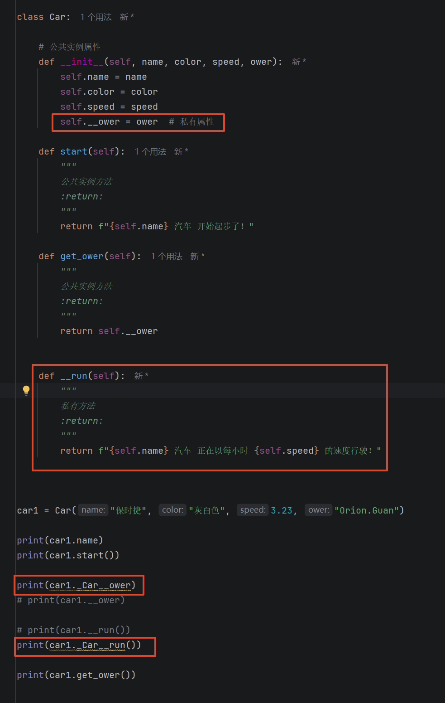
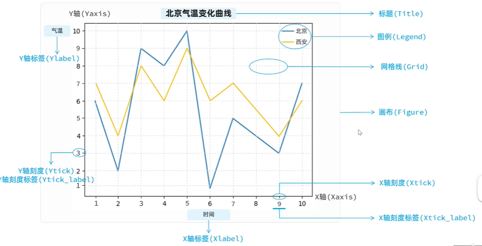
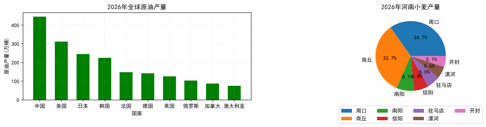

# Python基础速通笔记

## 目录

- [一、基本数据类型](#一基本数据类型)
  - [1.1 算数运算符](#11-算数运算符)
  - [1.2 比较运算符](#12-比较运算符)
  - [1.3 逻辑运算符](#13-逻辑运算符)
- [二、高级数据类型](#二高级数据类型)
  - [2.1 list 列表](#21-list-列表)
  - [2.2 tuple 元组](#22-tuple-元组)
  - [2.3 set 集合](#23-set-集合)
  - [2.4 dict 字典](#24-dict-字典)
- [三、条件判断](#三条件判断)
- [四、循环语句](#四循环语句)
- [五、函数](#五函数)
  - [5.1 函数定义](#51-函数定义)
  - [5.2 传参方式](#52-传参方式)
  - [5.3 全局变量与局部变量](#53-全局变量与局部变量)
  - [5.4 函数递归调用](#54-函数递归调用)
  - [5.5 lambda 表达式](#55-lambda-表达式)
- [六、异常处理](#六异常处理)
- [七、模块与包](#七模块与包)
  - [7.1 模块](#71-模块)
  - [7.2 包](#72-包)
  - [7.3 第三方包管理](#73-第三方包管理)
- [八、类与对象](#八类与对象)
- [九、文件操作](#九文件操作)
  - [9.1 操作普通文件](#91-操作普通文件)
  - [9.2 操作 JSON 串](#92-操作-json-串)
  - [9.3 操作 CSV 文件](#93-操作-csv-文件)
- [十、正则表达式](#十正则表达式)
  - [10.1 常用方法](#101-常用方法)
  - [10.2 模式规则](#102-模式规则)
  - [10.3 匹配次数](#103-匹配次数)
- [十一、数据分析](#十一数据分析)
  - [11.1 Pandas数据处理工具](#111-pandas数据处理工具)
    - [11.1.1 DataFrame与Series两大对象](#1111-dataframe与series两大对象)
    - [11.1.2 数据读写](#1112-数据读写)
    - [11.1.3 数据查看&选择&过滤](#1113-数据查看选择过滤)
    - [11.1.4 数据清洗](#1114-数据清洗)
    - [11.1.5 数据排序](#1115-数据排序)
    - [11.1.6 数据分组](#1116-数据分组)
  - [11.2 Matplotlib数据可视化图表工具](#112-matplotlib数据可视化图表工具)
    - [11.2.1 折线图](#1121-折线图)
    - [11.2.2 柱状图与饼图](#1122-柱状图与饼图)

---

## 一、基本数据类型

- `int` - 整数类型
- `float` - 浮点数类型
- `str` - 字符串类型
- `bool` - 布尔类型
- `NoneType` - 空类型

### 字符串格式化

```python
f'字符串文本{变量}'  # 模板字符串格式化
r'撸起袖子\n加油干'  # r 去除转义字符（\n）特殊含义，原样输出
```

### 1.1 算数运算符

```python
a // b  # 整除
a ** n  # a 的 n 次方
```

### 1.2 比较运算符

支持数学形式的比较，例如：`>`、`<`、`>=`、`<=`、`==`、`!=`

### 1.3 逻辑运算符

| 运算符 | 说明   | 特点                       |
|--------|--------|----------------------------|
| `and`  | 逻辑与 | 全真即真，有假即假（短路） |
| `or`   | 逻辑或 | 有真即真，全假为假（短路） |
| `not`  | 逻辑非 | 取反                       |

---

## 二、高级数据类型

### 2.1 list 列表

```python
list1 = [1, 2.4, True, 'Hello', 1]
```

**特点**：有序、可重复、可修改

**列表推导式**：

```python
[item for item in range(10) if item > 3]
```

**解包 & 组包**：

```python
list2 = [*list]
```

---

### 2.2 tuple 元组

```python
tuple1 = (1, 2.1, 1, 'str', False)
```

**特点**：有序、可重复、不能修改

**解包**：

```python
a, *b, c = (1, 2, 4, 5, 6)  # a=1, c=6, b=[2, 4, 5]
```

---

### 2.3 set 集合

```python
set1 = {1, 2, 'str', True}
```

**特点**：无序且唯一，不支持切片和索引访问

**集合推导式**：

```python
{item for item in range(10) if item > 5}
```

---

### 2.4 dict 字典

```python
dict1 = {key: value, key: value}
```

**特点**：

- 键必须是不可变类型
- 值可以任意类型
- 键若已存在则修改会覆盖原值

**字典推导式**：

```python
{key: key * 2 for key in range(10) if key < 8}
```

---

## 三、条件判断

### if-elif-else 结构

```python
if 逻辑表达式:
    代码块
elif 逻辑表达式:
    代码块
elif 逻辑表达式:
    代码块
else:
    代码块
```

### match-case 结构（Python 3.10+）

```python
match 变量:
    case 常量:
        代码块
    case 常量 | 常量:
        代码块
    case 常量 if 条件:
        代码块
    case _:
        其他默认情况代码块
```

---

## 四、循环语句

### for 循环

```python
for item in range(1, 10, 1):
    循环体
else:
    正常迭代完毕执行代码块（遇到
    break
    则不执行）
```

### while 循环

```python
while 逻辑表达式:
    循环体
else:
    正常迭代结束执行的代码块（遇到
    break
    则不执行）
```

### 循环控制关键字

| 关键字     | 说明                             |
|------------|----------------------------------|
| `break`    | 退出本层循环                     |
| `continue` | 结束本层的本轮循环，开始下轮循环 |

---

## 五、函数

### 5.1 函数定义

```python
def func(形参1, 形参2=默认值, *args, **kwargs):
    函数体
    return
```

**参数说明**：

- `*args` - 收集多个位置参数到元组
- `**kwargs` - 收集多个关键字参数到字典

### 5.2 传参方式

| 方式       | 说明                             |
|------------|----------------------------------|
| 位置传参   | 一一对应，类似 Java              |
| 关键字传参 | `func(key1=value1, key2=value2)` |

### 5.3 全局变量与局部变量

```python
global 变量名  # 在函数内声明为函数外的全局变量赋值
```

### 5.4 函数递归调用

- 递推 → 递归，必须有结束返回条件

### 5.5 lambda 表达式

```python
# 定义（自动返回表达式计算的结果）
func_address = lambda 形参1, 形参2: 表达式

# 调用
func_address(实参1, 实参2)
```

---

## 六、异常处理

> 默认方法报错后，异常信息会沿着调用链逐层向源头返回，并导致程序运行终止。一旦异常被捕获，则异常信息不会再向源头返回，也不会阻止程序正常执行。

```python
try:
    代码块
except Exception as error:
    处理异常代码块（try 中的代码块抛出异常后执行此方法）
finally:
    释放资源代码块（不管
    try 中是否抛出异常都会执行）
```

---

## 七、模块与包

### 7.1 模块

> 一个 `xxx.py` 文件就是一个模块，模块中可以是变量、函数、类与对象。

```python
from 模块 import *  # 导入模块
```

### 7.2 包

> 如果一个目录下包含 `__init__.py` 文件，则此目录就是软件包，该文件中定义包的元信息。

**内建变量**：

| 变量名     | 说明                                                                        |
|------------|-----------------------------------------------------------------------------|
| `__name__` | 在当前模块执行表示 `"__main__"`，作为其他模块导入执行时表示模块文件名字符串 |
| `__all__`  | 定义软件包或者模块中对外导入该模块或包时，暴露给 `*` 通配符的成员有哪些     |

### 7.3 第三方包管理

```bash
pip install 软件包名  # 下载第三方软件包
```

---

## 八、类与对象

```python
class ClassName:
    # 类属性
    father_name = "Orion"
    father_age = 62
    father_gender = '男'

    # 魔术方法。定义实例属性（类似 Java 类中的构造器，创建对象时自动调用）
    def __init__(self, name, age, gender):
        self.name = name
        self.age = age
        self.gender = gender

    # 定义实例方法（self 表示类创建的每个实例对象，调用时不用赋值）
    def func(self, 参数):
        方法体
```

**说明**：以 `__函数名__()` 命名的方法都是魔术方法，魔术方法会在程序执行的特定时期自动调用。

类的使用:

```python
personObj = ClassName('小关', 26, '男')  # 创建对象

personObj.name  # 访问实例属性
ClassName.father_name  # 访问类属性
personObj.func(实参)  # 调用实例方法
```

### 8.1 封装
封装就是将数据（成员属性）和 操作数据的方法（成员方法）放一起构成一个整体，这个整体就是一个类。

#### 8.1.1 私有属性 和 私有方法
- __属性名: 私有属性
- __方法名: 私有方法

特点:
1、私有属性和私有方法只能在类的内部供类中的其他方法调用，不能在类的外部通过类的对象访问（在类内部使用）。
2、如果想在类的外部访问这些私有属性和方法，一般是通过在类中定义公共方法来实现间接访问，如：get、set方法

注意: Python是没有类似Java那样真正的私有机制，这些私有属性和方法之所以无法直接在类的外部访问，是因为Python内部通过改写私有属性和私有方法的名称来实现的，即在私有成员的名称前隐式添加了”_类名“。
>

### 8.2 继承
继承主要是为了解决在创建类时，对于多个类都需要的成员属性和方法，如果都写在每个类中，就会导致代码重复，不利于维护。为了解决成员属性和方法重复在每个类中编写，
我们就可以把这些每个类在创建时都需要的公共属性和方法抽取到一个父类中，然后让子类继承父类，这样子类就会拥有父类的成员属性和方法，而不用每个子类都编写相同的代码.

```python
class 子类名(父类名):
    pass
```
说明:
- 定义的类如果没有显式使用括号指定要继承的父类，则默认继承自object类，即所有类都是object类的子类。

- 子类只能继承父类中所有公有的成员属性和方法，无法继承父类中的私有属性和方法。

#### 8.2.1 方法重写
如果子类继承父类中的某个公共方法无法满足特定需求，子类可以在其内部重新定义该方法，即方法重写。
这样，子类对象调用该方法时，将执行子类中重写后的方法，而不是父类中的方法。

>说明: 如果子类重写父类的方法体中想调用父类中被重写的同名方法，有如下两种方式
> 1. 使用 "super().父类方法名()" 方式调用
> 2. 使用 "父类名.方法名(self)" 方式调用

注意: 子类重写父类方法时，方法名和参数列表必须与父类中的方法完全一致。

### 8.3 多态


## 九、文件操作

### 9.1 操作普通文件

```python
with open("文件路径", "打开模式", encoding="utf-8") as fileObj:
    代码块
```

**使用步骤**：

1. 打开文件：`file = open("文件路径", "打开模式", encoding="utf-8")`
2. 读写操作：
    - `file.read()` - 读取全部内容
    - `file.write("内容")` - 写入全部内容
3. 关闭文件：`file.close()` - 关闭文件，刷新缓冲区并释放资源

### 9.2 操作 JSON 串

```python
import json

# 序列化字典数据到文件
json.dump(dict, file, ensure_ascii=False, indent=2)
# ensure_ascii=False 确保能打开文件能正确解析中文
# indent=2 确保序列化到文件中的 json 串是格式化后的

# 将文件中的 json 数据反序列化到字典变量
data = json.load(file)
```

### 9.3 操作 CSV 文件

```python
import csv

with open('文件路径', '打开方式', encoding='utf-8', newline='') as f:
    # 写入行数据
    writer = csv.DictWriter(f, fieldnames=['姓名', '年龄', '性别'])
    writer.writeheader()  # 写入表头
    writer.writerow({'姓名': '张三', '年龄': 20, '性别': '男'})

    # 读取 csv 文件内容
    reader = csv.DictReader(f)
    for row in reader:
        print(row)
```

---

## 十、正则表达式

```python
import re
```

### 10.1 常用方法

| 方法                           | 说明                     | 返回值               |
|--------------------------------|--------------------------|----------------------|
| `re.match(模式字符串, 文本)`   | 开头匹配                 | Match 对象           |
| `re.search(模式字符串, 文本)`  | 任意位置匹配，只匹配一次 | Match 对象           |
| `re.findall(模式字符串, 文本)` | 全局匹配                 | 所有匹配的字符串列表 |

**Match 对象方法**：

| 方法                      | 说明                                               |
|---------------------------|----------------------------------------------------|
| `obj.group(组号索引下标)` | 获取匹配的字符串                                   |
| `obj.span()`              | 匹配到的字符串在文本中的索引位置（不包含结束索引） |
| `obj.start()`             | 获取开始索引                                       |
| `obj.end()`               | 获取结束索引                                       |

### 10.2 模式规则

| 符号       | 说明                                     |
|------------|------------------------------------------|
| `.`        | 匹配任意单个字符（除\n换行符外）         |
| `[A-Za-z]` | 匹配单个英文字母（大小写）               |
| `[^aeiou]` | 匹配非中括号内的任意单个字符             |
| `\d`       | 匹配单个数字                             |
| `\D`       | 匹配非数字的单个字符                     |
| `\s`       | 匹配单个空白字符（空格、制表符、换行等） |
| `\S`       | 匹配非空格单个字符                       |
| `\w`       | 匹配单个普通字符串（数字、字母、下划线） |
| `\W`       | 匹配单个非普通字符即特殊字符             |
| `普通字符` | 直接匹配普通字符                         |

### 10.3 匹配次数

> 定义前个模式规则字符的匹配次数

| 符号          | 说明                               |
| ------------- | ---------------------------------- |
| `*`           | 前个字符匹配任意个数               |
| `+`           | 前个字符至少匹配一次               |
| `?`           | 前个字符至多匹配一次               |
| `{n}`         | 前个字符必须匹配 n 次              |
| `{min,}`      | 前个字符至少匹配 min 次            |
| `{min, max}`  | 前个字符匹配 min 到 max 之间个次数 |
| `^字符串`     | 目标文本必须以指定字符串开头       |
| `字符串$`     | 目标文本必须以指定字符串结尾       |
| `str1 | str2` | 目标字符串要么是 str1，要么是 str2 |
| ()            | 分组匹配提取值                     |

---

## 十一、数据分析

> 以下进入数据分析领域，需要 `pandas` 和 `matplotlib` 两个第三方库，可通过 `pip install pandas matplotlib` 安装。

### 11.1 Pandas数据处理工具

```python
import pandas as pd
```

#### 11.1.1 DataFrame与Series两大对象

- DataFrame对象: 代表表格
- Series对象: 代表表格中的某列

```python
from operator import index

import pandas as pd

#创建DataFrame对象方式
df1 = pd.DataFrame([
    {"name": "张三", "age": 18},
    {"name": "李四", "age": 19},
    {"name": "王五", "age": 20}
])
df1

df2 = pd.DataFrame({
    "name": ["张三", "李四", "王五"],
    "age": [18, 19, 20]
})
df2

df3 = pd.DataFrame([
    ['张三', 18],
    ['李四', 19],
    ['王五', 20]
], columns=["name", "age"])
df3

df4 = pd.DataFrame([
    ['张三', 18],
    ['李四', 19],
    ['王五', 20]
], columns=["name", "age"], index=['a', 'b', 'c'])  # 创建DataFrame并指定索引
df4

df5 = pd.DataFrame([
    ('张三', 18),
    ('李四', 19),
    ('王五', 20)
], columns=["name", "age"])
df5

# DataFrame常用属性
df5.index.tolist()  #表格的行索引

df5.columns.tolist()  #表格表头

df5.values.tolist()  #表格的值

df5.size  #获取单元格个数

df5.dtypes  #获取各列类型

df5.shape  #获取表格数据维度(3行数, 2列数)


# 创建Series对象方式

s1 = pd.Series([10, 9, 23, 24])
s1

s2 = pd.Series((10, 9, 23, 24), index=['a','b','c','d'])
s2

s3 = pd.Series({'a':10, 'b':9, 'c':23, 'd':24})
s3


# Series常见属性
s3.index.tolist()   #获取索引
s3.values.tolist()   #获取值
s3.size   #获取元素个数
s3.dtype   #获取数据类型
s3.shape  # 获取数据包维度(4行,)
```

#### 11.1.2 数据读写

- read_xxx("文件路径")：读取文件获取DataFrame对象。如: read_csv, read_excel
- to_xxx("保存到的文件路径")：保存文件到本地目录 如: to_csv, to_excel

#### 11.1.3 数据查看&选择&过滤

##### 11.1.3.1 数据查看

- head(行数) ------查看前几行
- tail(行数) ------查看后几行
- describe() ------查看表格数值列统计信息
- info() ----------查看表结构

##### 11.1.3.2 选择数据

###### 选择列

- df['列名'] --------查看某一列
- df[['列名1','列名2']] --------查看多列

###### 选择行(行切片)

- df.iloc[start:end:step] -------按行切片，不包含end行(tip: 表格行号固定从0开始，不同索引列)
- df.loc[start:emd:step] --------按索引列切片，包含end行

##### 11.1.3.3 过滤数据

语法: df[条件表达式]

```python
示例: df[(df['单价'] >= 100) & (df['类别'].isin(['类别1','类别2',...]))]   # 筛选出单价大于等于100的数据，且类别是类别1或类别2的数据
```

#### 11.1.4 数据清洗

##### 空值处理

- isnull() -----查看表格是否有空值
- dropna() -----默认删除空值所在行，也可以指定参数删除空值所在列
- fillna("填充值") -----按指定参数填充空值
- ffill() -------使用空值所在的上行列的值填充空值
- bfill() -------使用空值所在的下行列的值填充空值

##### 重复值处理

- duplicated() -----默认查看整行是否有重复值，也可以参数指定查看某列是否有重复值
- drop_duplicates()-----默认只保留首行，也可指定参数设置删除规则

##### 异常值处理

- df[筛选条件] ----查看异常数据
- df['列名'].str.replace('/','-') -----处理替换某列的异常值

#### 11.1.5 数据排序

```python
#先根据上映时间升序排序，相同的部分在根据评分降序
df.sort_values(["上映时间","评分"],ascending=[True,False])
```

#### 11.1.6 数据分组

```python
import pandas as pd
df = pd.read_csv('data/movies_info3.csv', nrows=50)

# 求取每个年份的电影时常之和
df.groupby('年份')['时常'].sum()

# 获取每年电影评分的最大值
df.groupby('年份')['评分'].max()

# 获取每年电影评分的最小值
df.groupby('年份')['评分'].min()

# 获取每年电影的数量
df.groupby('年份')['电影名'].count()

# 获取每年电影评分的平均值
df.groupby('年份')['评分'].mean()

# 获取每年电影评分的最大值、最小值、平均值
df.groupby('年份')['评分'].agg(['min', 'max', 'mean'])

# 获取每年电影时常的最大值，电影评分的平均值
df.groupby('年份').agg({'时常':'max', '评分':'mean'})
```

---

### 11.2 Matplotlib数据可视化图表工具



#### 11.2.1 折线图

```python
# 导入matplotlib包下的 pyplot 模块，并使用 plt 简写
import matplotlib.pyplot as plt
import random

#目标： 绘制一个折线图

#准备数据
x_axis = [item for item in range(0,25)]
y_axis = [random.randint(0,50) for item in range(0,25)]
y_axis_2 = [random.randint(0,50) for item in range(0,25)]

#设置画布宽高
plt.figure(figsize = (10,4))

#绘制折线
plt.plot(x_axis,y_axis,label = "河南")
plt.plot(x_axis,y_axis_2,label = "浙江")

#设置标题
plt.title("24小时温度变化")

#分别设置x轴和y轴的标签
plt.rcParams['font.sans-serif'] = ['SimHei'] #设置字体
plt.xlabel("时间")
plt.ylabel("温度")

# 设置x轴与y轴的刻度
plt.xticks(x_axis)
plt.yticks(range(0,51,5))

#设置网格线
plt.grid( linestyle='--', alpha = 0.5)

#设置图例
plt.legend()
```

#### 11.2.2 柱状图与饼图



```python
from matplotlib.axes import Axes
import matplotlib.pyplot as plt

# 设置中文字体
plt.rcParams['font.sans-serif'] = ['SimHei']

# 创建子图: figure 画布对象，axes数组子图对象
figure, axes = plt.subplots(nrows=1, ncols=2, figsize= (17, 3)) # 创建1行2列的子图，图形大小为10x5

#准备数据
countries = ['中国', '美国', '日本', '韩国', '法国', '德国', '英国', '俄罗斯', '加拿大', '澳大利亚']
oil_production = [445.3, 310.9, 244.6, 223.4, 147.6, 141.6, 124.1, 102.6, 85.7, 74.8]

#获取第一个子图对象
axes1:Axes = axes[0]

#绘制柱状图
axes1.bar(countries, oil_production, color='green', width=0.6)

#设置x轴和y轴标签
axes1.set_xlabel('国家')
axes1.set_ylabel('原油产量(万桶)')

#设置网格线
axes1.grid(linestyle='--', alpha=0.2)

#设置标题
axes1.set_title('2026年全球原油产量')


#操作第二个子图
axes2:Axes = axes[1]

#准备数据
wheat_yield = [14.51, 14.09, 3.4, 2.83, 2.51, 2.33, 2.12]
region = ['周口','商丘','南阳','信阳','驻马店','漯河','开封']

#绘制饼图。设置autopct参数，显示每个扇区的百分比
axes2.pie(wheat_yield, labels=region, autopct='%1.1f%%')

#设置标题
axes2.set_title('2026年河南小麦产量')

#设置图例. loc: 图例位置，ncol: 图例列数，bbox_to_anchor: 图例位置偏移量(0.5控制水平位置，-0.3控制垂直位置为下移)
plt.legend(loc='lower center', ncol=4, bbox_to_anchor=(0.5, -0.3))

#保存图片
plt.savefig('../data/2026年河南小麦产量.png')

#显示图形
plt.show()
```